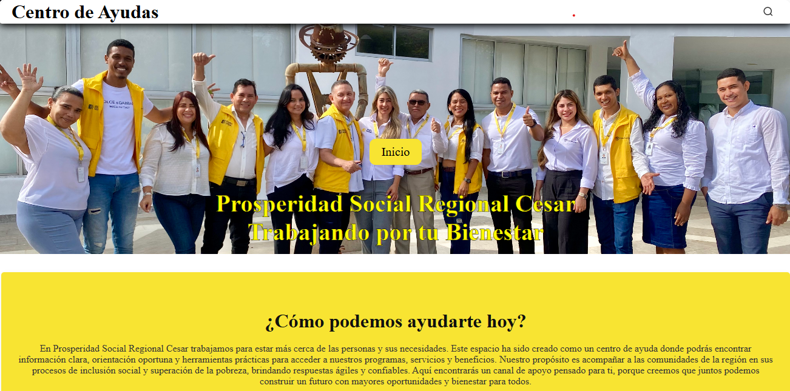

#  Centro de Ayudas - Prosperidad Social Regional Cesar

 <!-- Aquí puedes poner una captura representativa de tu web -->

##  Descripción

Este proyecto es una **plataforma web de apoyo comunitario** desarrollada para Prosperidad Social Regional Cesar, con el propósito de brindar a la ciudadanía un espacio donde encontrar:

- Información clara y accesible.  
- Orientación oportuna.  
- Herramientas prácticas para acceder a programas, servicios y beneficios sociales.  

La web busca acompañar a las comunidades en sus procesos de inclusión social y superación de la pobreza, ofreciendo respuestas ágiles y confiables.  

---

##  Objetivos del Proyecto

- Crear un **centro de ayuda digital** para la comunidad.  
- Centralizar información en un formato fácil de usar.  
- Facilitar el acceso a planes, actividades y guías comunitarias.  
- Fortalecer la red de líderes sociales de la región.  

---

##  Estructura del Proyecto

```bash
├── Videos/                  # Material audiovisual
├── assets/images/           # Imágenes y recursos gráficos
├── css/                     # Hojas de estilo (styles.css)
├── docs/                    # Documentos de apoyo
├── ABC.html                 # Página informativa ABC
├── Actividades.html         # Sección de actividades
├── Historias.html           # Historias de cambio
├── Lideres.html             # Red de líderes
├── Plan Comunitario.html    # Información sobre planes comunitarios
├── guias.html               # Guías y material de apoyo
├── index.html               # Página principal
└── README.md                # Este archivo

